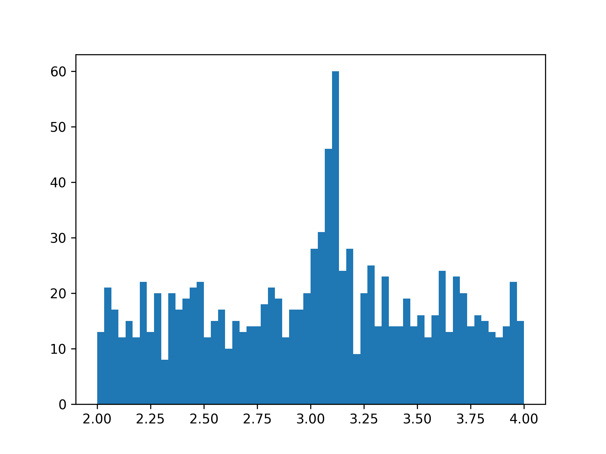
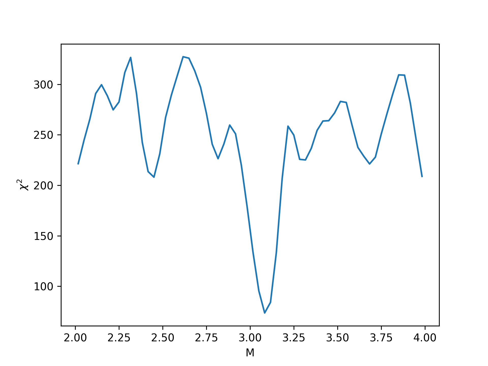

## Prologue

This is a record of a workshop on statistics
held among the High-Energy Physics group of National Taiwan University in 2022.

The textbook referred to throughout the record is 
Behnke, O. (2013) *Data analysis in high energy physics a practical guide to statistical methods / edited by Olaf Behnke...[et al.].* 1st ed. Weinheim, Germany: Wiley-VCH.

In this week, we covered Sec.2.4–2.6, which was mainly about the method of least squares and maximum-likelihood fits.

The workshop was to let the participants reproduce the histogram fitting on $M_{\mu^+\mu^-}$ in Subsubsec.2.4.2.1.

## Tools[^imports]

[^imports]: It’s assumed that you’ve already imported the familiar modules i.e. `import numpy as np; import matplotlib.pyplot as plt; import scipy.stats as st; import scipy.optimize as opt`.

### `np.concatenate`

```python
a = np.asarray([1, 2])
b = np.asarray([3, 4])
c = np.concatenate((a, b))  # Note the ntuple!
print(c)
```

```plaintext
[1 2 3 4]
```

### `plt.hist`

Does not just draw a histogram, but also returns the histogram and the bins in use.

```python
entries, bins, _ = plt.hist(st.norm.rvs(size=1000))
```

## Least-Squares Fit

### Prepare pseudo-data and histograms

By inspection and information given in the book, it seems that

* the number of bins is 60,
* the background events can be simulated by `st.uniform(loc=2, scale=2)` and the event number is roughly 1000, and
* the signal events can be simulated by `st.norm(loc=3.1, scale=0.05)` and the event number is roughly 100.



<!--
```python
data = np.concatenate((st.uniform(loc=2, scale=2).rvs(size=1000), st.norm(loc=3.1, scale=0.05).rvs(size=100)))
ks, bins, _ = plt.hist(data, bins=np.linspace(2, 4, 61))
```
-->

### Construct expected number of events in each bin

Assuming we know the exact numbers of background and signal events, then the number of events in each bin is just $$f_i = 1000 \cdot f^B_i + 100 \cdot f^S_i,$$ where $f^B_i$ and $f^S_i$ are probabilities of events in the $i$\-th bin i.e. 

$$\begin{aligned}
f^B_i &= \int^{x^{\mathrm{up}}_i}_{x^{\mathrm{low}}_i} f^B(x) \,dx, \\
f^S_i &= \int^{x^{\mathrm{up}}_i}_{x^{\mathrm{low}}_i} f^S(x;M) \,dx.
\end{aligned}$$

In the discrete case, we can approximate the integral as $$f^B_i = \int^{x^{\mathrm{up}}_i}_{x^{\mathrm{low}}_i} f^B \,dx \approx \sum_i f^B(x^c_i) \,\Delta x_i,$$ and so on, where $x^c_i$ is the center of the bin i.e. $x^c_i = (x^{\mathrm{up}}_i+x^{\mathrm{low}}_i)/2.$


<!--
```python
xc = (bins[1:] + bins[:-1]) / 2
dx = bins[1:] - bins[:-1]
def fs(M): return 1000 * st.uniform(loc=2, scale=2).pdf(xc) * dx + 100 * st.norm(loc=M, scale=0.05).pdf(xc) * dx
plt.plot(xc, fs(M=3.1))
```
-->

### Calculate, plot and minimize $\chi^2$

Recall that the (Neyman's) $\chi^2$ value can be calculated as $$\chi^2(M) = \sum_{\text{bin} i} \frac{\Big[k_i - f_i(M)\Big]^2}{k_i}.$$ 

<!--
```python
def chi2(M): return np.sum((ks - fs(M))**2 / ks)
```

```python
vec_chi2 = np.vectorize(chi2)
plt.plot(xc, vec_chi2(xc))
```

```python
opt.minimize(chi2, x0=3.1)
```
-->



## Binned Maximum-Likelihood Fits

Use the same dataset (and the same histogram) to perform Binned MLE. Note that the log-likelihood in the binned case is $$\ln L(M) = \sum^B_{i=1} k_i \ln P_i(M) + \textrm{constant},$$ where $P_i(M)$ is the **likelihood** computed with the probability of events falling within the $i$\-th bin.

<!--
```python
def n2ll(theta): return -2. * np.sum(ks * np.log(10/11 * st.uniform(loc=2, scale=2).pdf(xc) * dx + 1/10 * st.norm(loc=theta, scale=0.05).pdf(xc) * dx))
opt.minimize(n2ll, x0=3.1)
```
-->

## Remarks

### On Numbers of Generated Events

What would happen if we only generated `st.norm.rvs(loc=3.1, scale=0.05, size=100)` and set bins as `np.linspace(-5, 5, 101)` instead? What assumption of Least-Squares Fit would be violated? What Python error would you get?

### On Assumptions of Event Numbers

Recall that we assume that we know the exact numbers of both signal and background events. That is not a common situation in practice, though. We typically need to turn those event numbers into parameters as well. And that is what the next week's workshop is about, Extended Maximum-Likelihood Fits.

### On $\chi^2_\textrm{min}$

You may get $\chi^2_\textrm{min}$ deviated from the expected value, which is 59, as much as, say, 68. Do you think it's reasonable? (Hint: go the wikipedia page of $\chi^2$ distribution and look for the quantity related to expected deviation from the expected value.)
